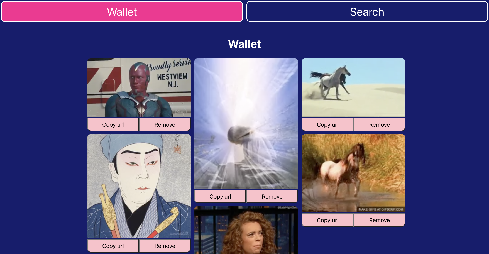

# My Gif Wallet

## Table of contents
* [General Info](#general-info)
* [Technologies](#technologies)
* [Usage](#usage)

## Introduction

This purpose of this repository is to build an app that covers two main use cases:
- search for gifs
- store a collection of gifs

Secondary use cases include adding, removing gifs from collection, and copying gif source url for sharing on social media.

## Technologies

- Giphy API 
- Firebase (for noSQL datastore and google authentication)
- OAuth
- Netlify (for deployment)
- React, Javascript, HTML, CSS
- [react-infinite-scroll-component](https://github.com/ankeetmaini/react-infinite-scroll-component#readme) for infite scroll on search results.
- [react-masonry-css](https://github.com/paulcollett/react-masonry-css#readme) to order items into columns where items of different heights sit snugly underneath the item above, like masonry.

## Usage

To open the app, click [here](https://my-gif-wallet.netlify.app/).
